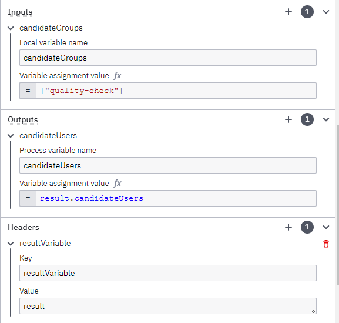
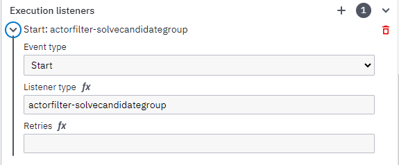
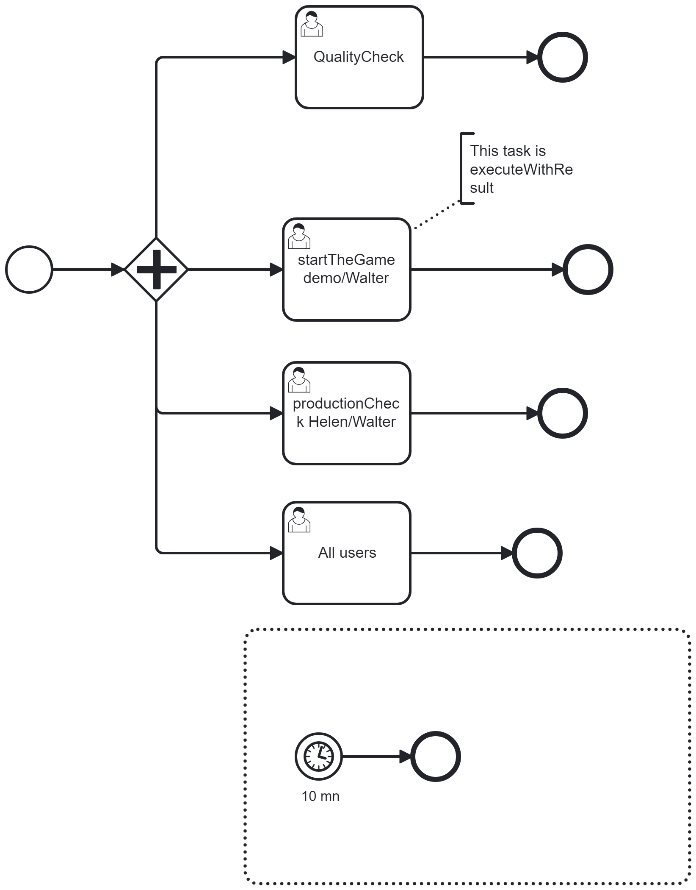
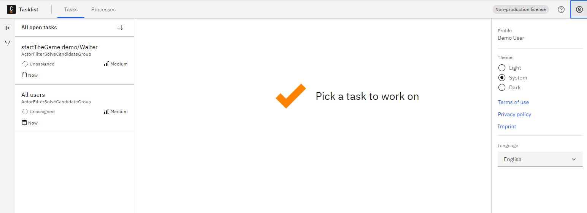
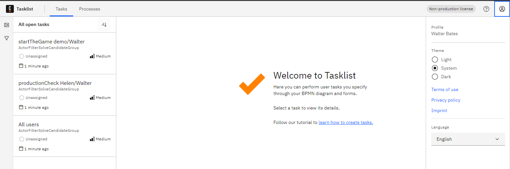

[](https://github.com/Camunda-Community-Hub/community/blob/main/extension-lifecycle.md#stable-)
[](https://github.com/camunda-community-hub/community)


# C8-actorfilter-solvecandidatesgroup

# Principle

Using the candidate groups in a user task, filtering who can access the specific task is possible.

The group features are not implemented when Identity is connected directly to an IDP. When a task is assigned to a group,
TaskList checks if the connected user is registered in that group, and Identity returns nothing: the task is not visible.

This Actor filter is a workaround. It has to be implemented.

# Actor filter

The actor filter's principle is to be placed in front of a user task. Because it is executed before the TaskList solves the Candidate Groups and Candidate User, it's possible to add a policy.

This actor filter will read the candidateGroup, calculate the list of group users, and update the candidatesUsers.
Then, if a user is in the group, it will be in the candidateuser and will see the task.

To that, the actor filter needs one input, the candidateGroups. It will produce one output, the candidateUsers


Then, it has to be registered as a START listener


Last but not least, the candidateUser must be mapped


Note: It may be possible to allow the actor filter to write directly in the CandididateUsers field, but for the moment, this mapping is necessary.


# An example
Deploy the process


* the task `QualityCheck` has an assignment to the group `quality-check`, but without the actor filter. Nobody will see that task
* the task `StartTheGame demo/Walter` got the assignment `quality-check`, with the actor filter. `demo` and `walter.bates` will see that task
* the task `productionCheck Helen/Walter` got the assignment `production-check`with the active filter. `helen.kelly`and `walter.bates` will see the task.
* the task `All users` does not have any assignment; it will be visible to all users


The implementation for the demonstration is this.

```java
   Map<String, Object> variables = new HashMap<String, Object>();
    if ("quality-check".equals(firstCandidateGroup))
      variables.put("candidateListOfUsers", List.of("demo", "walter.bates"));
    else if ("production-check".equals(firstCandidateGroup))
      variables.put("candidateListOfUsers", List.of("helen.kelly", "walter.bates"));
```
If the group is "quality-check", it returns as user "demo" and "walter.bates". If the group is "production-check", it returns helen.kelly, and walter.bates

Run a process instance.

Connect as the user `demo`. In the task list, he sees two tasks.



Connect as the user `walter.bates`. In the task list, he sees three tasks.

